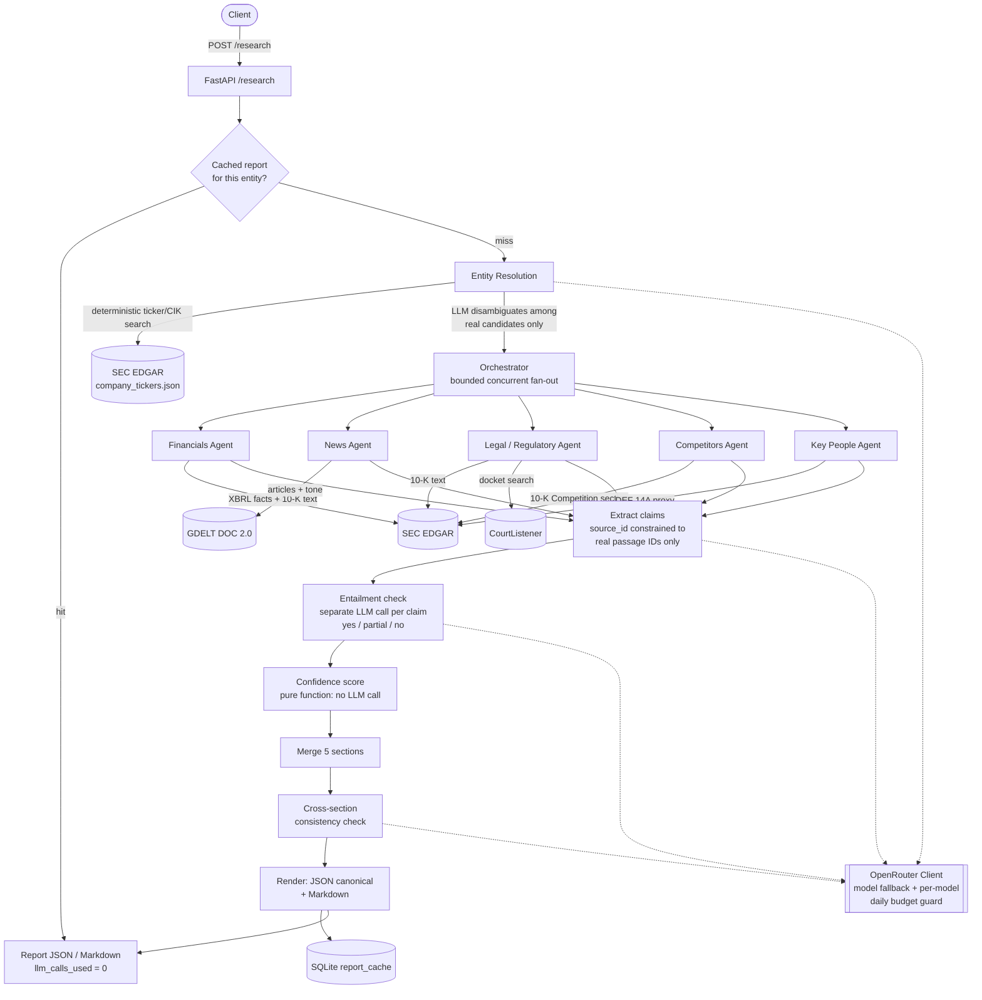

# InsightIQ

A FastAPI service that takes a company name and returns a structured due-diligence
report — financials, news, legal/regulatory exposure, competitors, key people — where
every claim is traceable to a specific retrieved source, every section carries a
computed confidence score, and cross-section contradictions are flagged before the
report ships.

## Problem statement

Due diligence research is slow, manual, and error-prone: an analyst pulls SEC
filings, news, court records, and proxy statements by hand, cross-checks them, and
writes it up. Point an LLM at the same task naively and you get a different problem —
a fluent report that quietly states figures the model half-remembers rather than
figures it actually looked up, with no way to tell which is which.

InsightIQ is built around one constraint: **an LLM is never allowed to state a fact
it wasn't just shown.** Every claim in the final report is extracted from a specific
retrieved passage (a filing excerpt, a headline, a docket entry), that extraction is
schema-constrained so the model can't cite a source it wasn't given, and a second,
separate LLM call verifies the passage actually supports the claim before it's
allowed to survive into the report. Confidence is a computed score, not a number the
model made up. A section with thin sourcing says so instead of writing around the
gap confidently.

## Architecture



Financials is the only section with a fully deterministic sub-path: headline XBRL
numbers (revenue, net income, assets, ...) are parsed from SEC structured data in
code, with `entailment` fixed to `"yes"` because no LLM ever produced them — there's
nothing to verify. Every other claim in every section goes through the same
extract → verify pattern (`app/agents/common.py`), proven once on financials'
narrative claims and reused, not reinvented, by news, legal/regulatory, competitors,
and key people.

## Database schema

SQLite (`insightiq.db`, gitignored, created on first run), three tables:

| Table | Columns | Purpose |
|---|---|---|
| `llm_usage` | `id`, `model`, `called_at`, `call_date` | One row per OpenRouter call. Backs the per-model daily budget guard (OpenRouter's free-tier cap is per model, not account-wide — see Tradeoffs) and the `llm_calls_used` figure on every response. |
| `courtlistener_usage` | `id`, `called_at` | One row per CourtListener call. Backs its own independent rate-limit guard (5/min, 50/hr, 125/day). |
| `report_cache` | `entity_key` (PK), `report_json`, `created_at` | Two logical uses of the same table: entity-resolution results keyed by `entity:<normalized query>`, and full reports keyed by `report:cik:<CIK>` or `report:private:<normalized name>`. TTL-checked at read time (`CACHE_TTL_HOURS`, default 24h) rather than pruned. |

No ORM — plain `sqlite3`, synchronous (call volume is one row per LLM/API call, well
below where blocking the event loop briefly would matter here).

## API examples

**Health check**

```bash
curl http://localhost:8000/health
# {"status": "ok", "llm_calls_used_today": 12, "daily_budget_per_model": 50,
#  "models_with_headroom": 14, "total_calls_remaining": 696, "models": [...]}
```

Because the free-tier cap is per model, the number that decides whether a run can
finish is `models_with_headroom`, not the total — hence the per-model breakdown.

**Run a report**

```bash
curl -X POST http://localhost:8000/research \
  -H "Content-Type: application/json" \
  -d '{"company_name": "Apple"}'
```

```json
{
  "company": "Apple",
  "resolved_entity": {
    "company_name": "Apple",
    "is_public": true,
    "cik": "0000320193",
    "ticker": "AAPL",
    "jurisdiction": "CA",
    "resolution_notes": "Apple Inc. (AAPL, CIK 0000320193) is the clear match for the query 'Apple'..."
  },
  "sections": [
    {
      "section": "financials",
      "summary": "Apple: revenue = $416.16 billion ...",
      "claims": [
        {
          "text": "Apple: net income (NetIncomeLoss) = $112.01 billion (112,010,000,000 USD) for period 2024-09-29 to 2025-09-27, per 10-K filed 2025-10-31 (accession 0000320193-25-000079).",
          "source_id": "xbrl_2",
          "source_url": "https://www.sec.gov/Archives/edgar/data/320193/000032019325000079/0000320193-25-000079-index.htm",
          "entailment": "yes"
        }
      ],
      "confidence": 0.86,
      "confidence_rationale": "7 claim(s) verified; source tiers: primary_filing; total corroborating sources: 7.",
      "data_gaps": [],
      "model_used": "minimax/minimax-m3:free"
    }
  ],
  "contradictions": [],
  "generated_at": "2026-09-01T12:00:00Z",
  "llm_calls_used": 23
}
```

**Same request, Markdown instead of JSON**

```bash
curl -X POST "http://localhost:8000/research?format=markdown" \
  -H "Content-Type: application/json" \
  -d '{"company_name": "Apple"}'
```

Returns `text/markdown` — confidence labeled High/Medium/Low/None, claims as a
numbered list with linked citations, data gaps and contradictions called out
explicitly.

**As a shareable report file (HTML)**

```bash
curl -X POST "http://localhost:8000/research?format=html&download=true" \
  -H "Content-Type: application/json" \
  -d '{"company_name": "Apple"}' \
  -o apple-report.html
```

HTML is the format for a file a person actually opens: it renders on double-click in
any browser with no tooling, keeps every citation clickable, works offline as a
single self-contained file (CSS inlined, no external assets), and prints to PDF via
Ctrl+P — none of which Markdown gives you (on Windows a `.md` opens as raw text) and
none of which needs a new dependency, unlike PDF (weasyprint/GTK) or DOCX.

Citations are numbered academic-style rather than a bare `[source]` link per claim:
sources are deduplicated across the whole report into a reference list, each claim
carries a superscript `[n]`, and each reference lists the sections citing it. That
makes thin sourcing visible — the Tesla run below collapses 37 claims onto just 6
distinct sources, which per-claim links actively hide.

Add `&save=true` (any format) to also write a copy server-side under `./reports/`.

**Converting an already-saved JSON response**

```bash
python -m app.render.export response.json -o report.html      # or -f markdown
```

**Repeat request within the cache TTL**

Same body, same endpoint → `llm_calls_used: 0` in the response, proving it came from
`report_cache` rather than re-running the pipeline.

## Setup

```bash
python -m venv .venv
.venv/Scripts/activate        # Windows; `source .venv/bin/activate` on macOS/Linux
pip install -r requirements.txt
cp .env.example .env          # then edit .env and set OPENROUTER_API_KEY
uvicorn app.main:app --reload --port 8000
```

Run the tests (fully mocked — no API keys or network required):

```bash
pytest
```

All config defaults live in `app/config.py`; `.env.example` documents every
override. The two worth setting for real use: `OPENROUTER_API_KEY` (required —
https://openrouter.ai/keys) and `EDGAR_USER_AGENT` (SEC requires a descriptive
User-Agent identifying you; the placeholder will eventually get rate-limited).

## Tradeoffs

Decisions made deliberately, with the alternative considered:

- **SQLite, not Postgres/Redis.** This is a single-process portfolio build, not a
  multi-tenant service. A file-based DB needs zero infrastructure and is trivially
  correct for the call-budget and cache use cases here; it would be the wrong choice
  the moment multiple processes need to write concurrently.
- **Synchronous `/research`, not SSE/polling.** A full run can take a while on
  rate-limited free models. Streaming progress would be better UX but adds real
  complexity (job state, reconnect handling) that wasn't worth it for a single-caller
  portfolio build — documented as a known gap rather than half-implemented.
- **No general web-search fallback.** Competitors/key-people data for a private
  company has no source in this build. No free/no-key web search API is reliable
  enough to depend on, and a scraped one would be fragile and likely violate the
  target sites' terms of service. The alternative — silently guessing from model
  memory — is exactly what this project exists to not do, so an honest gap was
  chosen over either extreme.
- **A hard cap (`max_claims`, default 8) on extracted claims per section.** Every
  surviving claim costs a separate entailment-verification LLM call. Uncapped, one
  narrative-heavy 10-K extracted 34 claims in testing and burned an entire day's
  free-tier budget on verification calls alone, before the other four sections could
  even run. Capping trades completeness for a run that actually finishes.
- **A hand-written confidence formula, not a learned/ML score.** Source tier +
  corroboration count + recency + entailment result, combined with fixed weights.
  Simple, auditable, and unit-testable with zero LLM calls — the tradeoff is it's a
  heuristic, not a calibrated probability.
- **Keyword-count chunk selection, not embeddings.** Retrieving relevant passages
  from a fetched filing uses cheap keyword scoring, not a vector index. No embedding
  model/vector DB dependency, at the cost of retrieval quality on filings where the
  relevant section doesn't share vocabulary with the keyword list.

## Known limitations

- **News claims are headline-only.** GDELT's DOC 2.0 API returns article metadata
  (title/url/date/domain), not body text, so a claim can't say more than a headline
  states. The tone/sentiment signal is a deterministic count from two tone-filtered
  GDELT queries, reported as approximate — never a precise score.
- **OpenRouter free-tier capacity is real and shared.** The daily cap is per model
  (confirmed empirically, not just per the docs), and free-model capacity is shared
  across every OpenRouter user hitting that model right now, not just your account's
  quota — expect occasional 429s from genuine platform congestion regardless of your
  own usage. This is why the fallback list is 16 models deep rather than 3: in a
  live test five consecutive models returned 429 from shared congestion before the
  sixth answered. A 429 is not retried on the same model (the list is the retry
  strategy) and costs no budget, since a refused request produces no completion.
- **EDGAR's full-text search returns metadata, not article/filing body text.**
  Where real passage text is needed (financials narrative, legal proceedings,
  competitors, key people), the agents fetch and chunk the actual filing instead —
  full-text search alone isn't sufficient for grounded extraction.
- **GDELT's API host is separately blockable.** `api.gdeltproject.org` is a single
  IPv4 host with no auth, and it throttles by silently dropping TCP connections
  rather than returning 429 — so it fails as a connect timeout, not an HTTP error,
  and can stay unreachable for long stretches while `www`/`data.gdeltproject.org`
  answer normally. The news path uses a short (8s) connect timeout so a blackholed
  host fails fast instead of stalling the whole synchronous run, and reports the
  failure as an explicit data gap. It cannot make the host reachable.
- **No authentication or multi-tenancy.** `/research` is open; there's no per-caller
  quota separate from the global daily LLM/CourtListener budgets.
- **Entity resolution mistakes propagate.** Every section keys off the resolved
  entity; if resolution picks the wrong company, every downstream section inherits
  that error. Mitigated (not eliminated) by constraining the model to only choose
  among real EDGAR candidates.
- **US SEC registrants only.** Financials, legal filings, competitors, and key-people
  sourcing all depend on EDGAR. Non-US and private companies get an honestly empty
  section with the gap stated, not a guess — but genuinely have far less coverage.
- **No native PDF output.** JSON, Markdown and HTML; PDF is via the browser's
  print-to-PDF rather than a server-side renderer, which avoids a heavyweight
  dependency but means the API can't hand back a `.pdf` directly.

## What to improve next

- Progress streaming (SSE or polling) for `/research` so a caller isn't blocked on
  the full synchronous run.
- A real (paid) web-search integration to close the private-company competitors/
  key-people gap, gated behind its own budget guard the same way OpenRouter and
  CourtListener are.
- Persist retrieved source passages alongside claims (not just the claim text + URL)
  for full auditability of what the model actually saw.
- Embeddings-based chunk retrieval instead of keyword counting, for filings where
  the relevant section doesn't share vocabulary with the keyword list.
- Move to Postgres for the cache/budget store if this ever needs to run as more than
  one process.
- API authentication and per-caller rate limiting, independent of the global daily
  budgets.
- CI running the test suite on every push.
